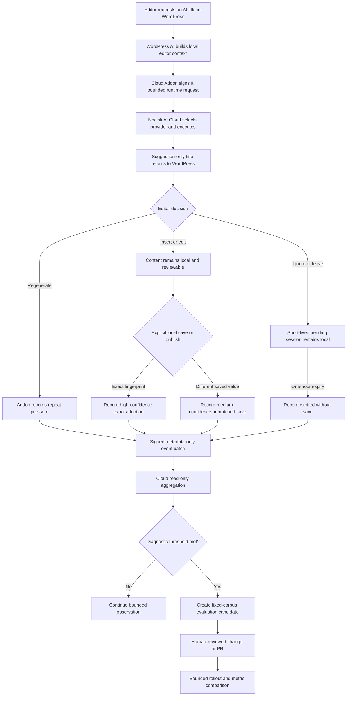

# Editor Assist Quality Flywheel Closeout and Development Retrospective — 2026-07-26

Status: source, protected merge, CI, and M4 acceptance receipt completed.
Production deployment and real-editor quality benefit are not claimed.

Scope: the discussion, design, implementation, verification, and closeout of
the metadata-only quality flywheel for WordPress AI title, summary, and rewrite
assistance. This record also captures the development lessons from the
intervening Python CVE decision and the final multi-repository delivery.

This is an evidence and retrospective record. It does not create a new
WordPress control plane, approve automatic prompt/model/router mutation, waive
release security gates, or authorize production deployment.

## Executive Summary

The original question was whether the AI title-generation flow was reasonable
and what should be built next. The important conclusion was that generation
itself was already bounded correctly: Cloud returned a suggestion, while the
editor retained review, insertion, save, and publication authority in local
WordPress.

The missing capability was not another generation API or dashboard. It was a
reliable, privacy-preserving connection between a generation and the editor's
later behavior. Without that connection, a technically successful provider
call could not answer whether the suggestion was useful.

The completed v1 closes that instrumentation gap:

- the Cloud Addon correlates title, summary, and rewrite generations with
  repeated generation, exact local save/publish, unmatched save, or expiry;
- it uploads only bounded metadata, keyed fingerprints, and HMAC scopes;
- Cloud aggregates the events into a read-only quality summary and diagnostic
  issue candidates;
- every issue candidate points to fixed-corpus evaluation rather than changing
  production behavior automatically;
- WordPress remains approval, adoption, and final-write truth.

The delivery used two protected pull requests:

- Cloud Addon PR
  [#57](https://github.com/npcink/npcink-cloud-addon/pull/57), merged as
  `4e8a39026fab02e884e2716151392699ea53b5e4`;
- Cloud PR
  [#279](https://github.com/npcink/npcink-ai-cloud/pull/279), merged as
  `11bdddb00750b765cc676a51214757b5a1faa9cf`.

Both repositories passed their focused and protected gates. Cloud
`master@11bdddb0` was promoted and recorded
`acceptance_state=accepted`, `promotion_pr=279`,
`source_branch=master`, and `source_dirty=false`. A later unrelated candidate
subsequently replaced the visible shared M4 preview state. That does not undo
the historical acceptance receipt, but it proves that M4 status is mutable
preview state and must not be used as a durable acceptance ledger.

## 1. How The Work Evolved

### 1.1 Start from the real title-generation path

The first discussion inspected the current AI title-generation path instead of
starting from a generic "AI flywheel" design. The product already had the right
ownership shape:

- WordPress owns editor context and user intent;
- the Addon signs and transports the bounded runtime request;
- Cloud owns hosted runtime selection and provider execution;
- Cloud returns a suggestion-only result;
- the editor decides whether to insert, change, save, publish, or regenerate;
- WordPress performs the only final content write.

This was already reasonable as a generation path. It was not yet sufficient as
a quality-learning path because provider success, HTTP `200`, and a generated
string do not prove user adoption.

### 1.2 Define the actual quality gap

The useful question became:

> Can a generated result be connected to later local behavior without
> uploading prompts, generated text, article content, post IDs, user IDs, or
> write authority?

The answer was a short-lived Addon correlation window plus metadata-only Cloud
aggregation. The v1 signals were deliberately conservative:

- `generation_completed`;
- `generation_repeated`;
- `saved_exact_output`;
- `saved_after_generation_unmatched`;
- `published_after_generation`;
- `expired_without_save`.

An unmatched save is medium-confidence evidence. It is not proof that the user
edited and adopted the output, and expiry is not proof of rejection.

### 1.3 Resist premature automation

The next-stage recommendation was not to auto-edit prompts, models, routing,
presets, or WordPress content. A small local sample cannot justify a production
mutation.

The approved loop is:

```text
silent observation
  -> read-only issue candidate
  -> fixed-corpus reproduction
  -> reviewed change proposal or PR
  -> human merge
  -> bounded rollout
  -> before/after metric comparison
```

The loop automates evidence collection and problem discovery while retaining a
human gate for behavior changes.

### 1.4 Separate the Python CVE from feature development

The Python 3.14 Alpine CVE watch temporarily appeared to block progress. The
wrong responses would have been:

- downgrade Python without compatibility and scan evidence;
- change an image digest without a supported fixed candidate;
- remove or silently extend the security exception;
- treat development inconvenience as permission to weaken release policy.

The correct separation was:

- ordinary source development could continue;
- protected CI and dependency checks remained active;
- production validation and GA remained subject to the dated risk decision,
  fresh image discovery, and fresh scan evidence;
- the upstream watch remained the durable mechanism for detecting a supported
  replacement candidate.

This prevented an external dependency from freezing unrelated development
without converting a known release risk into a silent waiver.

### 1.5 Implement the Addon and Cloud halves independently

The Addon implemented the observation owner:

- bounded pending records;
- keyed local fingerprints;
- HMAC object and actor scopes;
- repeat detection;
- explicit save/publish observation;
- expiry;
- opt-in metadata-only upload through the existing observability buffer.

Cloud implemented the read owner:

- additive scalar fields on the existing plugin-observability contract;
- strict input validation;
- a bounded internal read model;
- task and rate breakdowns;
- read-only issue candidates;
- an explicit `production_mutation=false` boundary.

No new database migration, queue, dashboard framework, feedback UI, workflow
engine, or control plane was added.

## 2. Current End-to-End Flow



The critical negative path is equally important:

```text
quality signal
  -X-> automatic prompt edit
  -X-> automatic model/router change
  -X-> automatic WordPress write
  -X-> automatic publication
```

## 3. Is This Flow Reasonable?

Yes, for a v1 instrumentation loop, with explicit limitations.

### What is structurally sound

- **Ownership is correct.** Cloud executes and summarizes; WordPress approves
  and writes.
- **Collection is metadata-only.** Prompt text, source content, generated text,
  real post IDs, and real user IDs are excluded from the Cloud contract.
- **Confidence is honest.** Exact fingerprint matches are high confidence;
  unmatched saves and expiry remain weaker signals.
- **Aggregation is bounded.** The internal endpoint uses a finite window and
  produces diagnostic candidates rather than permanent product scores.
- **Learning is governed.** A candidate enters fixed-corpus evaluation and
  protected Git review before any production behavior change.
- **Existing infrastructure is reused.** The design extends the Addon buffer
  and Cloud plugin-observability store instead of adding a telemetry platform.

### What v1 does not prove

- exact-save rate is not total usefulness;
- unmatched save is not edited adoption;
- expiry is not rejection;
- initial issue thresholds are diagnostic defaults, not validated product
  targets;
- a fixture and four focused Cloud tests do not prove real-editor benefit;
- M4 acceptance proves the merged runtime revision worked, not production or
  customer acceptance;
- the Python image risk remains a separate release concern.

The correct conclusion is therefore:

> The architecture is reasonable and the instrumentation seam is implemented.
> Product-quality benefit remains a measured next-stage question.

## 4. Delivery And Verification Evidence

### 4.1 Cloud Addon

PR #57 added the correlation owner and its documentation:

- feature commit: `55ddb10db62c7a1208d702ed44e393871b46d3c4`;
- merged revision: `4e8a39026fab02e884e2716151392699ea53b5e4`;
- `composer test:all`: passed;
- focused editor-assist behavior assertions: 8 passed;
- disposable Playground activation on WordPress 7.0.2 / PHP 8.2: passed;
- protected PHP contracts and PR body contract: passed.

The Addon still performs no content write. It only observes an explicit local
save or publish after WordPress has already made that decision.

### 4.2 Cloud

PR #279 added the strict event fields, internal aggregation, regression fixture,
tests, gate script, and boundary documentation:

- feature commits: `27495379` and `9282e775`;
- merged revision: `11bdddb00750b765cc676a51214757b5a1faa9cf`;
- `pnpm run check:editor-assist-quality`: 4 tests passed, targeted Ruff passed,
  and the no-auto-mutation boundary passed;
- the wider focused API/observability set recorded 20 passing tests in the PR;
- required PR checks passed;
- exact merged-`master` CI run
  [30184080831](https://github.com/npcink/npcink-ai-cloud/actions/runs/30184080831)
  passed backend, frontend, static analysis, secret scan, dependency audit, and
  PostgreSQL regression gates.

The six-repository quality matrix was rerun after exact Cloud `master` CI
completed and passed for the platform repositories in scope.

### 4.3 M4 acceptance receipt

The clean operations worktree promoted PR #279 from current `origin/master`.
The closeout receipt recorded:

```text
acceptance_state=accepted
promotion_pr=279
source_revision=11bdddb00750b765cc676a51214757b5a1faa9cf
source_branch=master
source_dirty=false
alembic_revision=20260717_0068 (head)
/=200
/health/live=200
```

The focused M4 editor-assist test recorded 4 passing tests. API, frontend,
PostgreSQL, Redis, proxy, and workers were healthy, and published ports remained
loopback-only.

At the time this retrospective was written, a subsequent unrelated development
candidate had replaced the visible M4 status. This is expected for a shared
preview, but it exposes an operational lesson:

- Git merge and CI are durable repository evidence;
- an M4 accepted status is a point-in-time runtime receipt;
- the current M4 status answers what is visible now, not the complete
  acceptance history;
- a closeout must persist the accepted revision, PR, and smoke evidence before
  another candidate is dispatched.

No production deployment was performed.

## 5. Work Review Report

### Original goal

Assess the existing AI title-generation path, identify whether it was
reasonable, recommend and implement the next stage, avoid letting the separate
Python CVE stall ordinary development, and close the resulting quality flywheel
through protected Git, CI, and M4 acceptance.

### Completion

- [x] Mapped the real title-generation and local-write flow.
- [x] Preserved the Cloud/WordPress ownership boundary.
- [x] Implemented metadata-only Addon correlation.
- [x] Implemented Cloud aggregation and diagnostic candidates.
- [x] Added focused fixtures, tests, lint, and no-auto-mutation gates.
- [x] Merged the Addon and Cloud pull requests through protected CI.
- [x] Ran the cross-repository matrix.
- [x] Promoted merged Cloud `master` and recorded M4 accepted evidence.
- [x] Kept production unchanged.
- [ ] Proved benefit with a real multi-editor cohort.
  Reason: that is the next observation phase, not a source-completion claim.

### Problems found

| Severity | Specific problem | Root cause | Improvement |
| --- | --- | --- | --- |
| Should correct | Early discussion risked treating "generation succeeded" as the end of the title flow. | The first framing focused on runtime execution rather than the full generation-to-adoption consumer path. | Trace generation, review, save/publish, later evidence, and improvement ownership before proposing implementation. |
| Should correct | The Python CVE was initially experienced as a general development blocker. | Development eligibility and production-release eligibility were not separated early enough. | Classify security findings by affected lane, keep a dated release exception/watch, and continue only the lanes whose gates remain valid. |
| Should correct | M4 `accepted` can disappear from the current status when a later candidate is dispatched. | A shared mutable preview was being read like a durable acceptance ledger. | Persist PR, revision, timestamp, focused smoke, and accepted fields in a dated record immediately after promotion. |
| Suggested | A stale dirty Addon worktree looked like an unpublished implementation even though PR #57 was already merged. | Local worktree state was inspected before fully reconciling remote branches, all worktrees, and PR history. | Inventory `git worktree list`, `origin/master`, topic branches, and PR state before deciding that uncommitted files are missing delivery work. |
| Suggested | Initial thresholds can look more authoritative than their evidence supports. | Numeric diagnostics are easy to mistake for product targets. | Label thresholds as initial candidates and require real-cohort calibration before tuning production behavior. |

### What worked well

- The implementation reused existing transport and storage instead of adding a
  new platform.
- High- and medium-confidence outcomes stayed distinct.
- The Addon and Cloud halves had separate focused contracts and rollback paths.
- Dirty worktrees were preserved; clean worktrees carried reviewable changes.
- Required GitHub checks, exact merged-revision CI, cross-repository gates, and
  M4 runtime acceptance answered different questions instead of being collapsed
  into one "done" claim.
- The security detour produced an explicit development-versus-release boundary
  instead of a downgrade guess or silent waiver.

### Next focus

- validate event completeness and classification accuracy with a bounded real
  cohort;
- compare local editor truth with emitted metadata without uploading content;
- calibrate diagnostic thresholds only after reviewing cross-site evidence;
- send problem candidates to fixed-corpus evaluation before proposing prompt,
  provider, model, or routing changes;
- preserve each future M4 accepted receipt in a dated durable record.

## 6. Reusable Development Method

### 6.1 Start from ownership, not feature names

"AI title generation" spans WordPress UI, Addon transport, Cloud runtime,
provider execution, local user action, and later evidence. Assign each state to
its owner before writing code. This prevents Cloud diagnostics from drifting
into approval or write authority.

### 6.2 Trace the full causal path

A provider call is only an intermediate event. For user-facing AI assistance,
trace:

```text
request -> execution -> suggestion -> review -> adoption/non-adoption signal
        -> aggregation -> evaluation -> reviewed change -> measured rollout
```

Stop the design where evidence becomes too weak. Do not infer rejection,
editing, or usefulness merely because those labels would make a cleaner
dashboard.

### 6.3 Prefer metadata and bounded correlation

Quality observability usually needs stable identifiers, timestamps, task types,
coarse outcome buckets, and keyed fingerprints—not prompt or content capture.
Use short retention, caps, HMAC scopes, additive schemas, and explicit
allowlists.

### 6.4 Keep automation on the evidence side

Automate collection, aggregation, issue detection, fixture reproduction, and
CI. Keep production prompt/model/router changes, rollout, and WordPress writes
behind review. This creates a useful flywheel without creating an ungoverned
self-modifying system.

### 6.5 Separate evidence states

Always report the highest state actually proved:

1. local verified;
2. candidate validated on M4;
3. PR verified;
4. merged into `master`;
5. accepted on M4;
6. production validated;
7. real-user benefit measured.

Later states do not erase the need to preserve earlier evidence, and one state
must not be used as shorthand for another.

### 6.6 Separate external risk from local progress

When an upstream CVE has no supported fixed candidate:

- do not invent a downgrade or repin;
- automate candidate discovery;
- keep the exception explicit and expiring;
- continue development lanes that do not weaken the affected release gate;
- require fresh scan evidence before production exposure.

### 6.7 Use clean worktrees and remote reconciliation

Before changing a dirty repository:

1. inspect status and all worktrees;
2. fetch the current base;
3. inspect remote branches and PRs;
4. distinguish duplicate local residue from unpublished work;
5. create a clean topic worktree from current `origin/master`;
6. stage only named task files.

This is safer than reset, stash, broad checkout, or committing whatever happens
to be visible in the first worktree.

### 6.8 Validate proportionally

- local exact tests answer whether the changed seam works;
- protected CI answers whether the revision is merge-eligible;
- the cross-repository matrix answers whether shared contracts still align;
- M4 answers whether the merged source works in the integration runtime;
- a real editor cohort answers whether the product signal is useful.

Running a larger test repeatedly does not replace choosing the correct evidence
layer.

## 7. Recommended Next Stage

The next stage should be instrumentation validation, not feature expansion.

Use a bounded first cohort:

- 2–3 consenting editors;
- at least 2 independent sites;
- title generation first, then summary and rewrite only after title signals are
  trustworthy;
- no more than roughly 30 real provider calls for the initial validation;
- a short, declared observation window.

Review:

- whether every eligible generation creates one completed event;
- whether repeats share the intended quality session;
- whether exact saves and publishes are classified correctly;
- whether unmatched saves are over-reported;
- whether expiry runs once and does not duplicate;
- whether opt-out and disabled monitoring produce no upload;
- whether events contain only the documented scalar metadata;
- whether site/task filters and latency percentiles agree with the fixture and
  manually reviewed local sequence.

Only after instrumentation is trustworthy should the team:

1. establish a baseline for repeat, exact-save, unmatched-save, publish, and
   expiry rates;
2. select one problem candidate with enough samples;
3. reproduce it in Eval Lab with a fixed corpus;
4. prepare one reviewed change;
5. run a bounded rollout;
6. compare the same metrics before and after;
7. keep or revert the change based on evidence.

Stop and investigate before tuning when event loss, duplicate sessions,
cross-task correlation, unexpected content fields, or uncertain local truth is
observed.

## 8. Boundary Closeout

This stage did not change product ownership:

- WordPress remains editor context, approval, adoption, save, publish, and
  final-write truth;
- the Addon remains a thin connector and metadata observation owner;
- Cloud remains hosted runtime, bounded aggregation, and read-only diagnostic
  evidence;
- Eval Lab remains the fixed-corpus reproduction surface;
- Git review and human merge remain the behavior-change gate;
- production remains separately authorized;
- the Python CVE remains governed by its own dated release decision and
  upstream watch.

The implementation phase is closed. The next valid work is measured
instrumentation acceptance, not another control surface or automatic
self-modification layer.

## Related Records

- [Editor Assist Quality Flywheel v1](editor-assist-quality-flywheel-v1.md)
- [Cloud Content Generation Boundary v1](cloud-content-generation-boundary-v1.md)
- [Cloud Agent Feedback Quality Gate v1](cloud-agent-feedback-quality-gate-v1.md)
- [Development and Validation Operating Model v1](development-validation-operating-model-v1.md)
- [M4 Preview AI Development Standard v1](m4-preview-ai-development-standard-v1.md)
- [Project Remediation and Development Retrospective — 2026-07-25](project-remediation-and-development-retrospective-2026-07-25.md)
- [Python 3.14.6 Controlled Production Validation Risk Decision](python-3-14-6-controlled-production-validation-risk-decision-2026-07-21.md)
